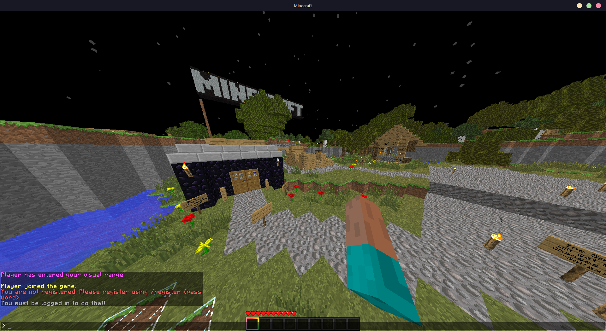
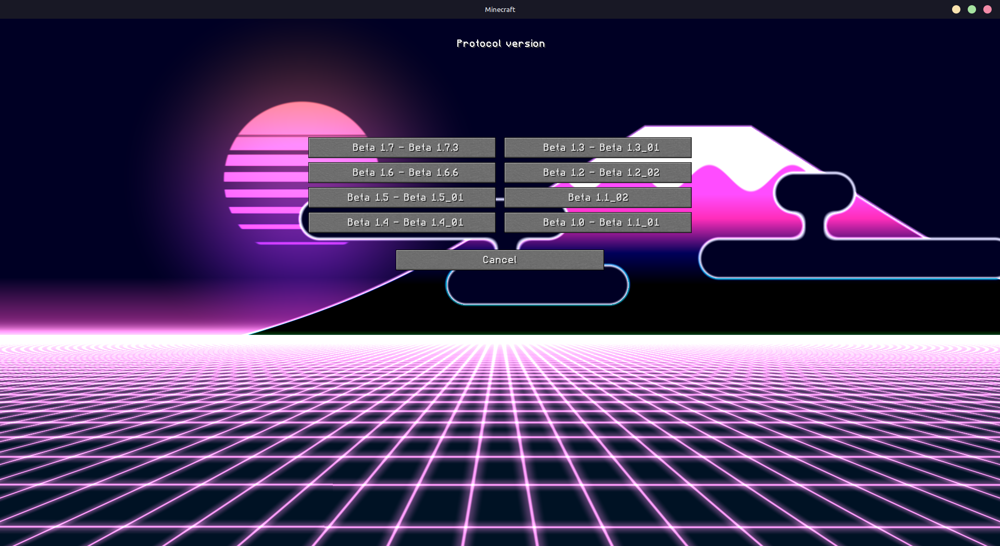
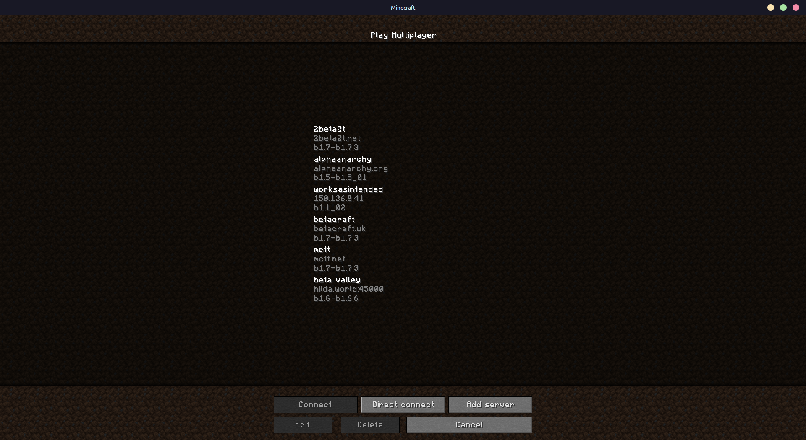

#  Multiproto No StAPI
Protocol translation mod for Babric without the retarded StAPI bloat.

Screenshot taken on [BetaValley](https://www.youtube.com/watch?v=XNROtZUusJE) my beloved <3

### Requirements

- [Babric](https://babric.github.io/)
- That's literally it. Nothing else. I do recommend getting [MojangFix](https://modrinth.com/mod/mojangfix) though.

MojangFix integration

### Precompiled version
Go [here](https://nightly.link/skibidiware/multiproto-nostapi/workflows/build/master), extract the .jar from the .zip and add it to your loader mods.